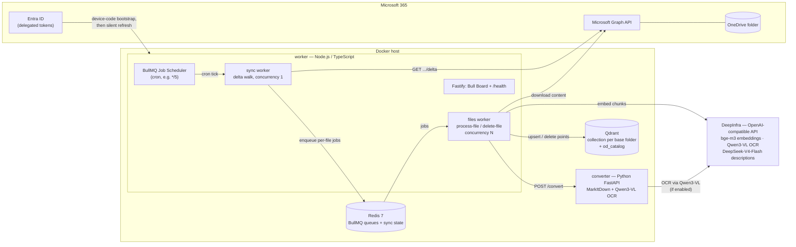
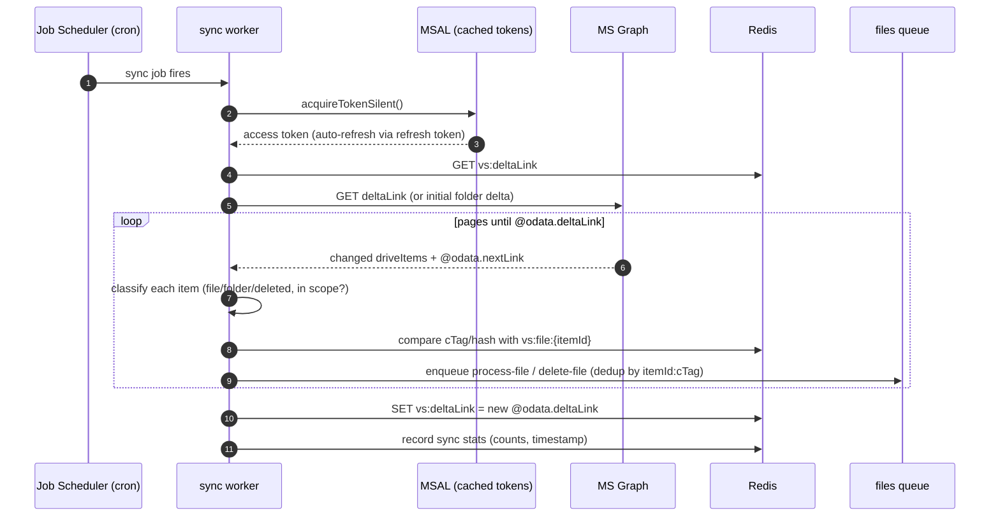
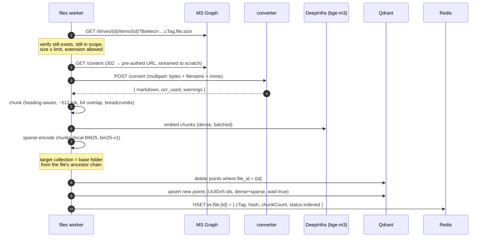

# 02 — Architecture

> Status: draft · Last updated: 2026-07-26

## 1. Component overview

Two custom services plus two off-the-shelf stores, all in one `docker compose` stack. Node.js owns orchestration (BullMQ is Node-first); Python owns document conversion (MarkItDown is Python-only). All AI calls — bge-m3 embeddings, Qwen3-VL OCR, DeepSeek catalog descriptions — go to **DeepInfra's OpenAI-compatible API** with a shared key by default, with each role independently overridable to a different provider. Full rationale in [03-tech-stack.md](03-tech-stack.md).

### Responsibilities

| Component | Owns | Explicitly does not |
|---|---|---|
| **worker** (Node) | Auth (MSAL cache), delta walking, job orchestration, download, chunking, embedding calls, local BM25 sparse encoding, Qdrant writes, sync state, dashboard | Parse document formats |
| **converter** (Python) | One thing: bytes in → Markdown out (MarkItDown; OCR of embedded images via Qwen3-VL on DeepInfra). Stateless. | Chunking, embeddings, any storage |
| **Redis** | BullMQ queues; `deltaLink`; per-file sync state (`cTag`, hash, chunk count, status) | Long-term truth (all rebuildable) |
| **Qdrant** | Vectors + payload: one collection per base folder, plus the `od_catalog` registry (the product of the whole pipeline) | — |

Splitting conversion into a sidecar keeps Python deps out of the Node image, keeps MarkItDown's heavy imports warm across files, isolates conversion crashes/OOM from the orchestrator, and lets conversion scale independently. (A `markitdown` CLI-subprocess fallback mode is documented in [10-decisions-and-risks.md](10-decisions-and-risks.md) → D3.)

## 2. Queue topology

Two queues (details in [07-bullmq-design.md](07-bullmq-design.md)):

- **`sync`** — one repeatable job from the Job Scheduler, plus **manual triggers** (`cli.js sync` / `yarn sync:once`) into the same queue. Processed with concurrency 1 so delta walks never overlap — a manual trigger during a running walk simply queues right behind it.
- **`files`** — fan-out: `process-file`, `delete-file`/`delete-folder`, `update-metadata` and `refresh-catalog` jobs, deduplicated (e.g. by `itemId:cTag`), concurrency N (default 4, **live-adjustable at runtime** — [07](07-bullmq-design.md) §1).

## 3. Sequence: scheduled delta sync

Change classification (full mapping table in [04-onedrive-graph-integration.md](04-onedrive-graph-integration.md)):

| Delta item looks like | Action |
|---|---|
| `file` facet, new or changed `cTag` | enqueue `process-file` |
| `file` facet, `cTag` unchanged, same base folder (rename/move within) | enqueue lightweight `update-metadata` (payload patch, no re-embed) |
| `file` facet, `cTag` unchanged, **different base folder** (moved across) | enqueue `process-file` re-route: index into the new base folder's collection, purge from the old |
| `deleted` facet + was a file | enqueue `delete-file` |
| `deleted` facet + was a folder | enqueue `delete-folder` (delete points by `ancestor_ids`) |
| `folder` facet changed (rename/move) | mark for path refresh (weekly reconcile in v1) |

## 4. Sequence: process one file

The **delete-then-upsert** per file guarantees no stale chunks survive when a document shrinks. The brief window where a file has zero points is acceptable for this use case (decision D7).

## 5. State & consistency model

**Source of truth:** OneDrive. Everything else is derived and rebuildable.

| State | Where | Lost ⇒ |
|---|---|---|
| `vs:deltaLink` | Redis | re-enumerate folder (cheap; hash-skip prevents re-embedding) |
| `vs:root` (driveId + folderId of the sync root) | Redis | re-resolve from configured path |
| `vs:collections` (base-folder id → collection name map) | Redis | rebuild from Qdrant collection list + catalog + folder listing |
| `vs:folder:{id}` (parent id + name, for ancestor resolution) | Redis | re-fetch item metadata from Graph on miss |
| `vs:file:{itemId}` (cTag, content hash, chunk count, status) | Redis | files re-processed once; hash check against Qdrant payload can short-circuit |
| Queue state | Redis | in-flight work re-enqueued next sync |
| Vectors + payload | Qdrant | full resync rebuilds (embedding cost applies) |

**Delivery semantics: at-least-once, made safe by idempotency.**

- The delta token is advanced only after a full page walk *and* all jobs enqueued. Crash mid-walk ⇒ next run re-reads the same window; `deduplication: { id: itemId:cTag }` collapses the duplicates.
- A `process-file` job re-run overwrites the exact same point IDs.
- A permanently failing file lands in BullMQ's failed set (visible in Bull Board) without blocking the token from advancing — the tradeoff is documented in D6/[10-decisions-and-risks.md](10-decisions-and-risks.md); the weekly reconcile + manual retry paths catch stragglers.

## 6. Failure modes

| Failure | Detection | Behavior |
|---|---|---|
| Graph 429 / throttling | HTTP status + `Retry-After` | `worker.rateLimit(retryAfter)` + `Worker.RateLimitError` — job requeued **without** consuming an attempt |
| Graph 5xx / network blip | HTTP status / exception | retry with exponential backoff (4 attempts) |
| Delta token expired | `410 Gone` | restart enumeration from `Location` header link; reconcile per `resyncChangesApplyDifferences` |
| Refresh token revoked / interaction required | MSAL error code | sync job fails with `AUTH_REQUIRED`; `/health` goes red; alert log; runbook: re-run device-code bootstrap |
| Converter timeout / crash / OOM | HTTP 5xx or timeout | retry ×4; then failed set (poison file). Container restarts via compose `restart: unless-stopped` |
| Unsupported / corrupt file | converter 415/422 | mark `skipped_unsupported` / `failed_conversion`, complete job (no retry) |
| Conversion yields ~nothing (scan with OCR off/failed) | near-empty markdown heuristic | index nothing, warn, `empty_conversion` counter on `/health` |
| DeepInfra 429 / outage (embeddings, OCR, descriptions) | HTTP status | 429 → rate-limit path (`Retry-After` honored); 5xx → backoff retries; work queues and drains |
| Qdrant down | connection error | retries; jobs pile up in `files` queue and drain on recovery |
| Redis down | BullMQ/worker cannot operate | workers pause (BullMQ reconnects); no data loss beyond in-flight duplicates (idempotent) |
| Oversized file | size from metadata | `skipped_too_large`, logged |

## 7. Scaling notes (beyond v1)

- **More throughput:** raise `files` worker concurrency (live via `cli.js concurrency <n>`, or the env baseline); run additional worker replicas (BullMQ coordinates via Redis); scale converter replicas behind its service name. The `sync` queue stays at concurrency 1 per drive.
- **More folders/users:** the state keys, dedup IDs and point IDs are already drive-qualified; add one Job Scheduler + token cache per account. (Multi-tenant is out of scope for v1.)
- **Bigger corpora:** Qdrant `on_disk` vectors/payload, quantization, and collection sharding are available before any architectural change is needed.
- **Many base folders:** each collection carries its own HNSW/segment overhead — beyond a few dozen base folders, revisit decision D12 (single collection + payload filter is the lighter alternative). The catalog makes either layout discoverable.
- **Lower latency:** add Graph change-notification webhooks to *trigger* the same sync job early — delta remains the mechanism that reports what changed ([04](04-onedrive-graph-integration.md) §8).
